# 🏥 Hospital Management System
A Windows desktop application built with C# .NET framework, and SQL Server. The application manages hospital operations, including doctor scheduling, patient records, and appointments.

## ✅ Features
- 🩺 Register patients, doctors, and users.
- 📅 Schedule, update, and cancel appointments.
- 🔐 User authentication, role-based access, and encrypting sensitive data.
- 💾 Log errors in the event viewer.
- 📊 Store and retrieve data from SQL Server.
- 💬 Send appointment confirmation SMS messages using the smsmode API. Note: During development, the integration successfully submits messages and receives tracking IDs, while actual delivery may vary in sandbox environments.
- 📲 Send reminders for upcoming appointments through SMS messages. This feature is done using the [Hospital_System_Appointment_Reminder_Service
](https://github.com/malakmuayad11/Hospital_System_Appointment_Reminder_Service).

## ⬇️ Installation
Note: This application needs to run in administrator mode to log errors in the event viewer.
1. Clone the repository: git clone https://github.com/malakmuayad11/Hospital-Management-System.git
2. Restore the database from the backup file, using SQL Server Management Studio.
3. Open the project in Visual Studio.
4. Configure the connection string from the Hospital_System.config file.
5. Press Start to run the application.

## ⚙️ Technologies:
- C# (.NET Framework / .NET)
- SQL Server
- Windows Forms
- ADO.NET
- Three-tier architecture
- smsmode API.

## 📸 Screenshots

### 🏠 Login Screen
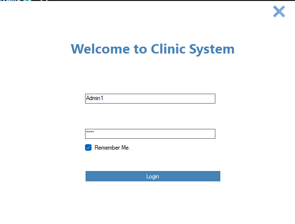

### 📱 Main Screen
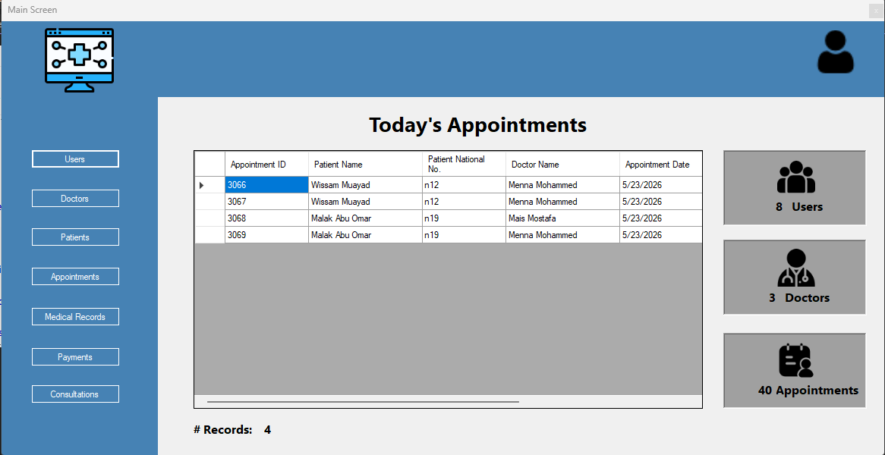

### 👥 Manage Users
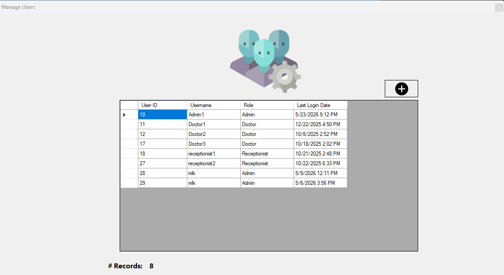

### 👤 Add New User

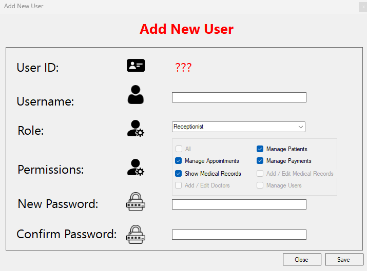

### 🩺 Manage Doctors

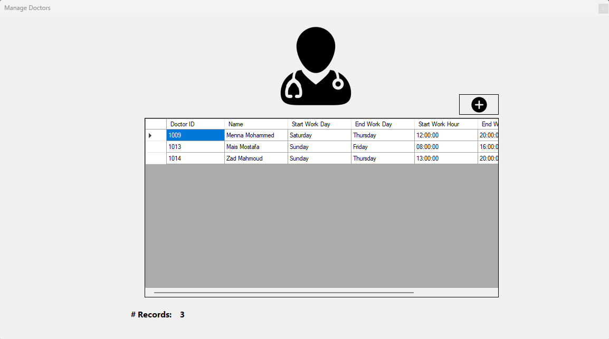

### 💉 Schedule Appointment

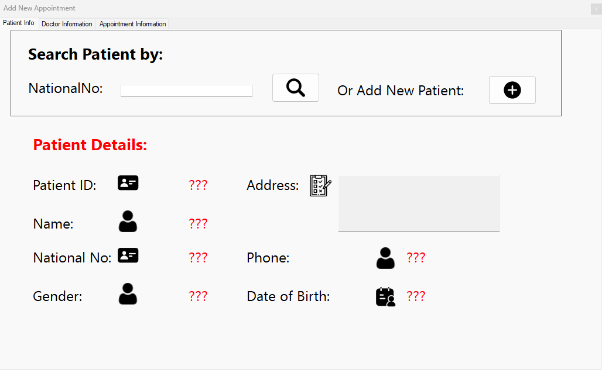

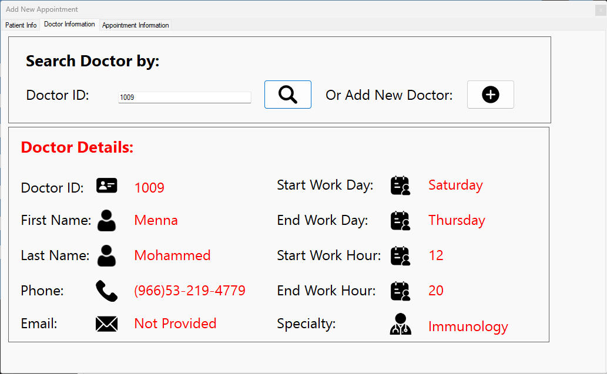

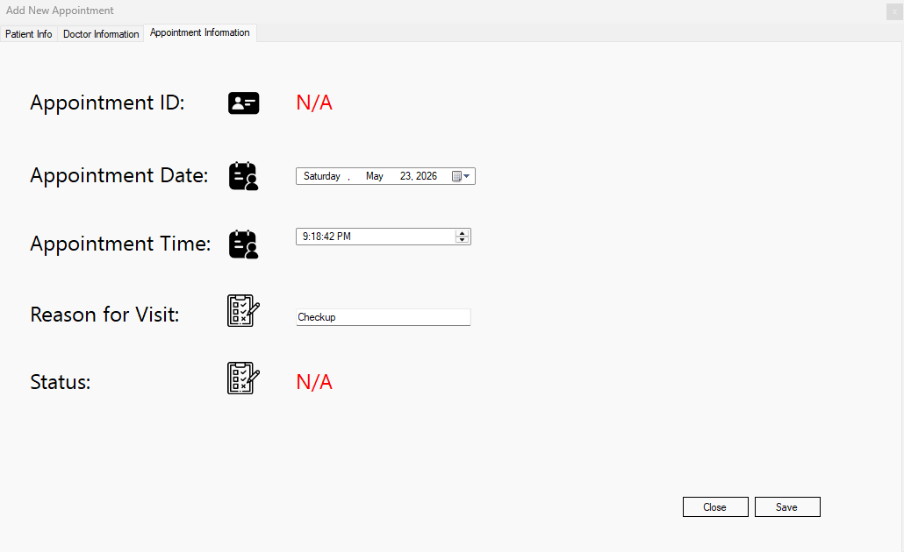

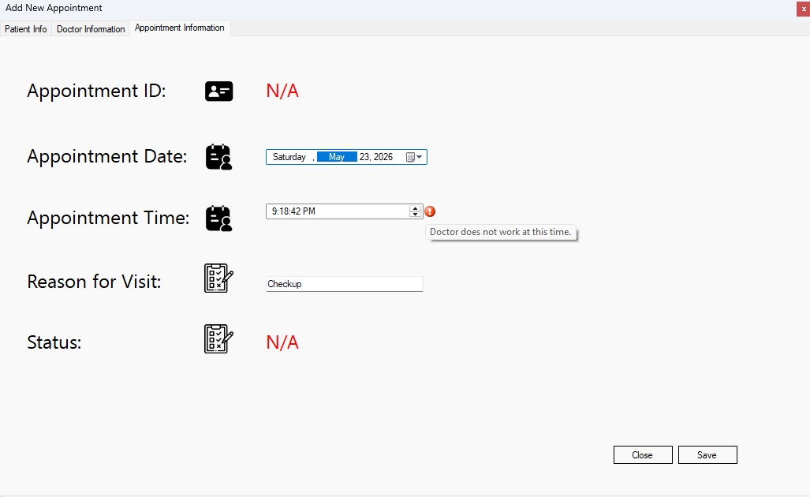

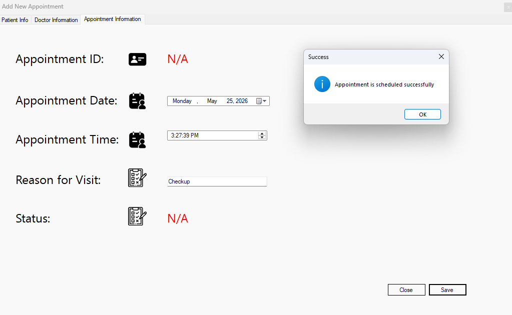

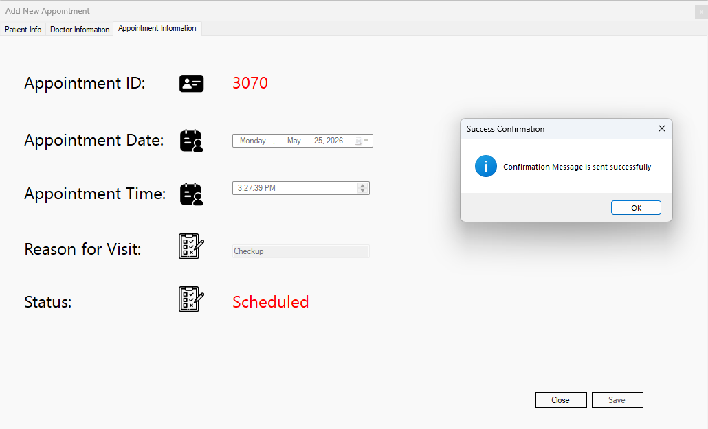
The confirmation message is an SMS message sent to the patient using the smsmode API.

### ⚕️ Manage Medical Records

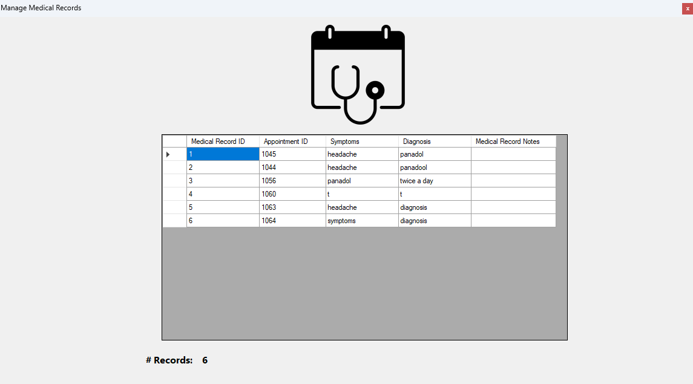

### 💲 Manage Payments

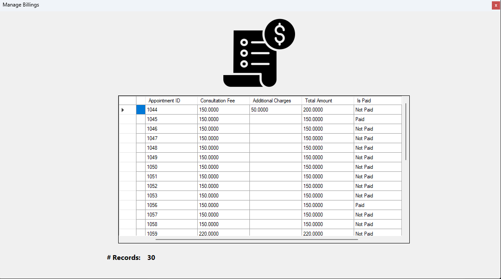

### 🧑‍⚕️💬 Manage Consultations

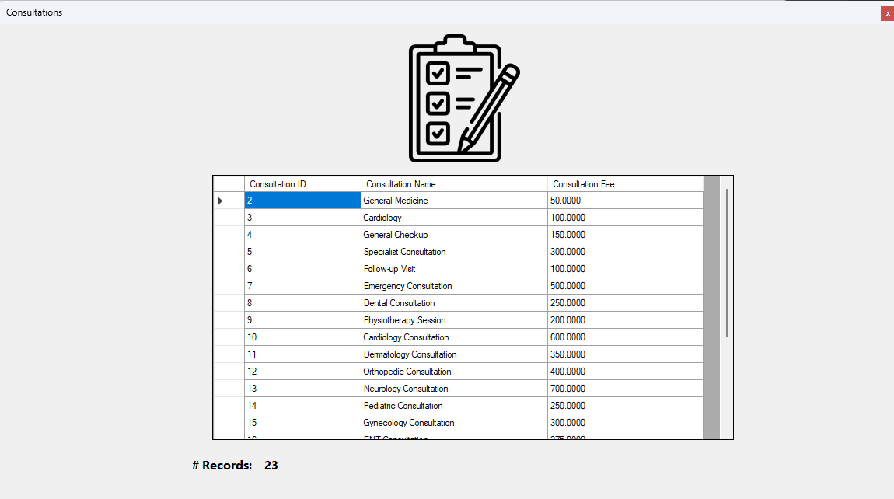

### 🥼 Logging in as a Doctor:

#### 📱 Main Screen

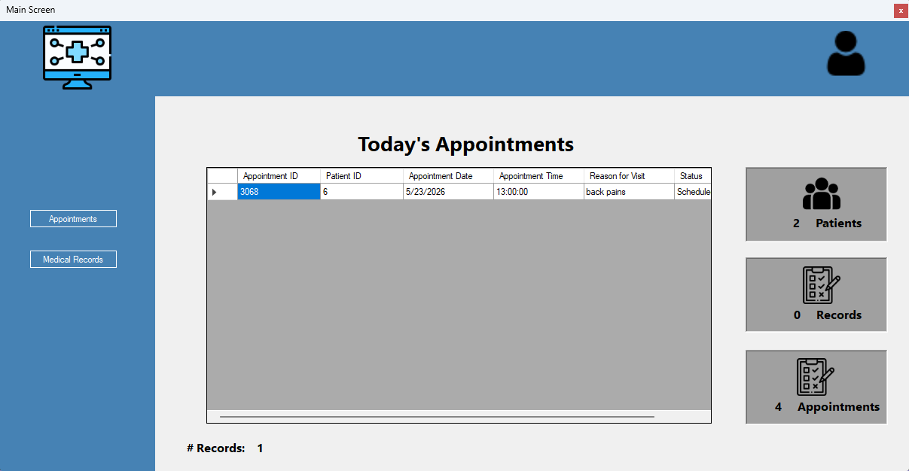

#### 💉 Manage Appointments
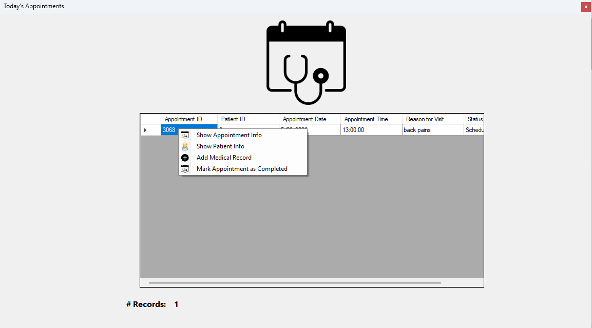

#### 💊 Manage Medical Records

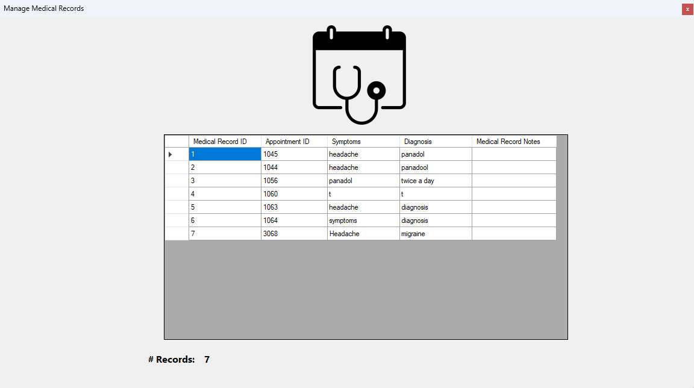

#### ➕💊 Add Medical Record

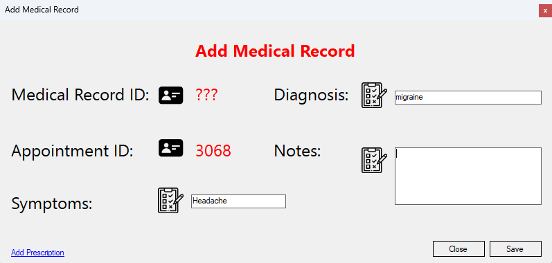

#### ➕ Add Prescription

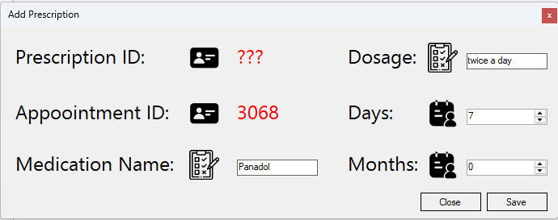

## 👩‍💻 Author
**Malak Muayad**  
📧 [malakmuayad15@gmail.com](mailto:malakmuayad15@gmail.com)  
🔗 [malakmuayad11](https://github.com/malakmuayad11)
